## Breather
*Identificando los elementos de navegación*
**-Global** 
- Llamamos a este tipo de navegación global porque siempre te llevara a la pagina principal, con esto queremos decir que es lo principal de la pagina.
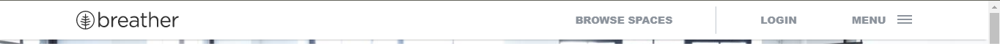

- Con este otro caso tambien podemos ver que es navegación global.

**-En Linea**
- Navegación en linea son los links referenciados que encontraremos en la pagina.
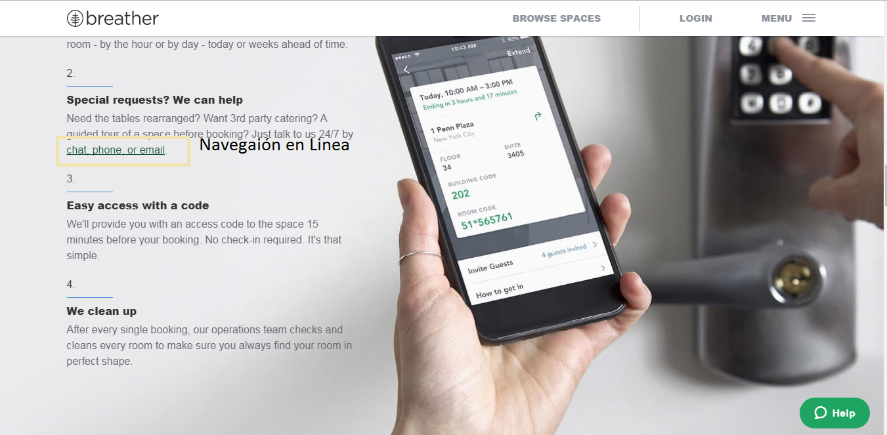

**-Filtrada**
- Aqui el usuario puede filtrar mediante las opciones su preferencia.
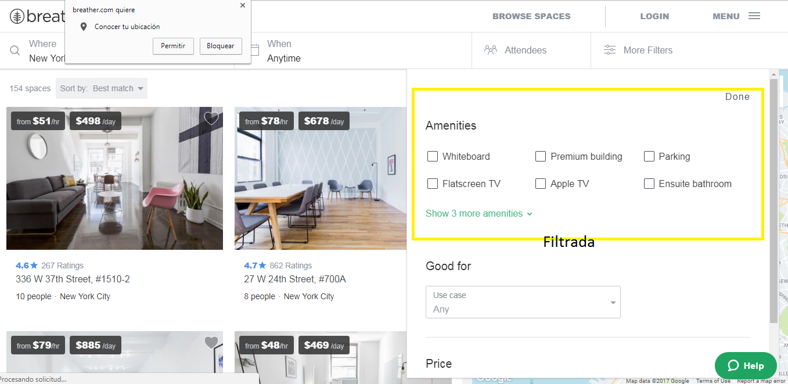

**-Contextual**
- Navegacióon contextual es cuando te sugiere la misma pagina, en este caso te sugiere distintos puntos en el mapa.
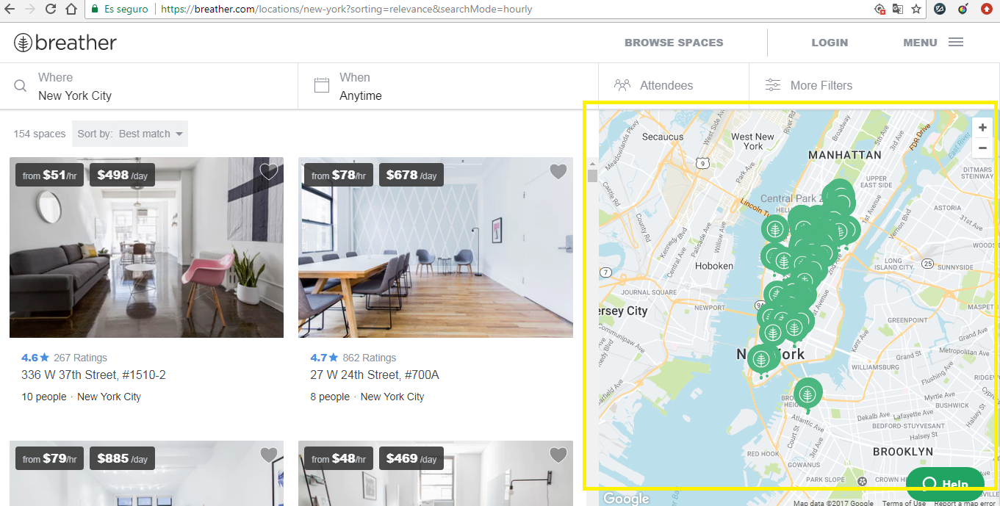

## GitHub
*Elemetos deNavegación*
**-Global** 
- Es el Elemento principal.
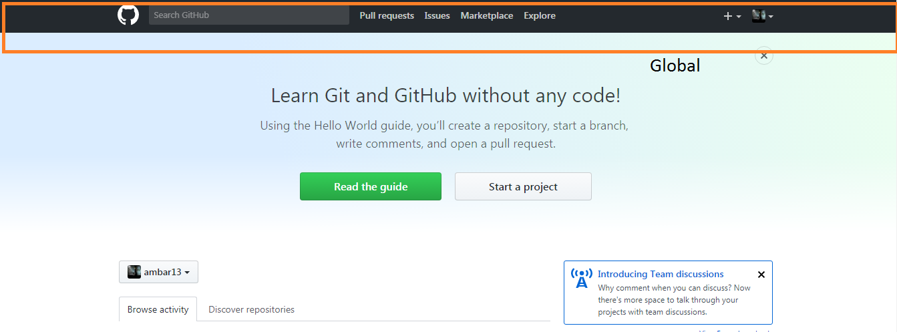

**-En Linea**
- Navegación en linea son los links referenciados que encontraremos en la pagina.
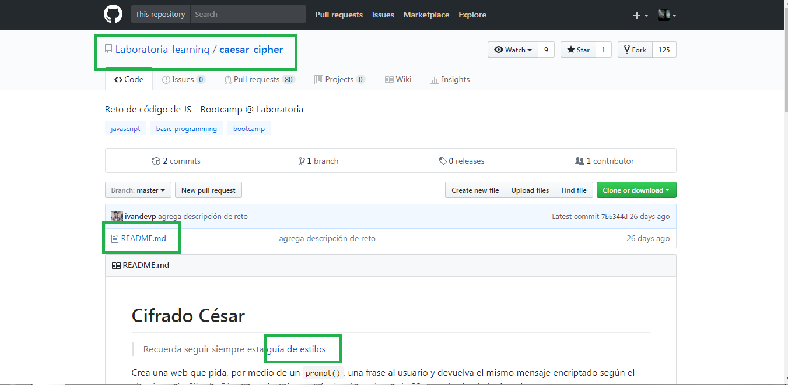

**-Contextual**
- Navegación contextual son las sugerencias de la página.
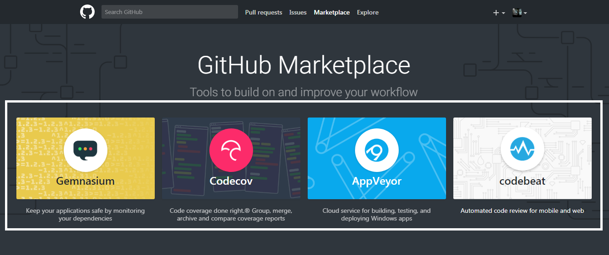

**-Facetada**
- Navegacióon facetada son los filtros que vienen ya con la página, que puedes elegir mediante paquetes.
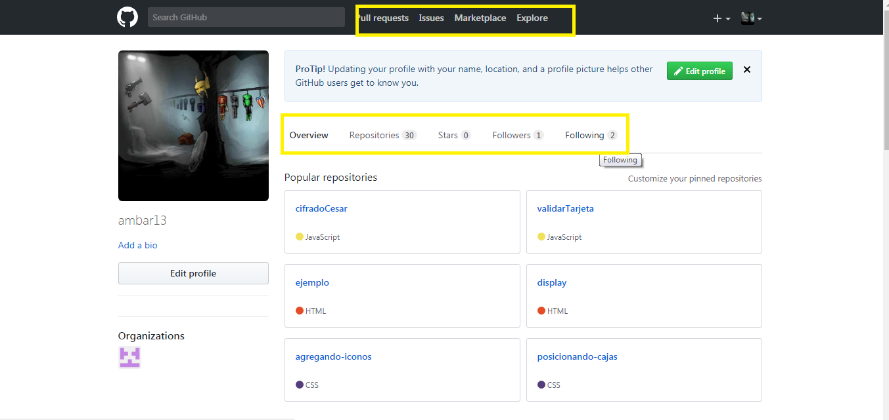

## Medium
*Elemetos deNavegación*

**-Global** 
- Es el Elemento principal.
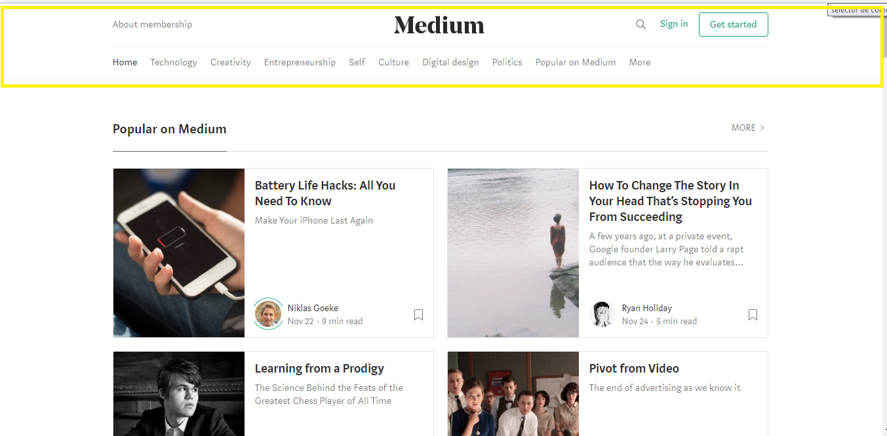

**-En Linea**
- Navegación en linea son los links referenciados que encontraremos en la pagina.
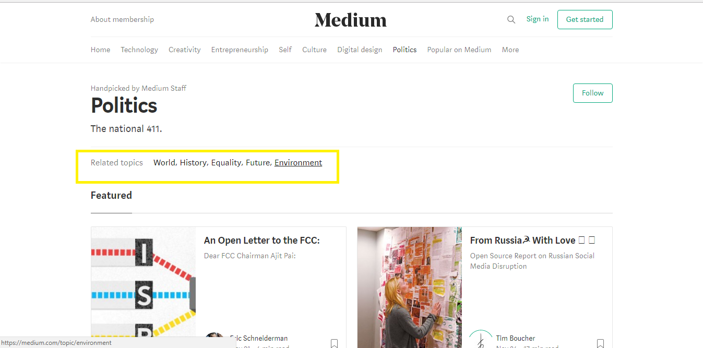

**-Filtrada**
- Aqui el usuario puede filtrar mediante las opciones su preferencia.
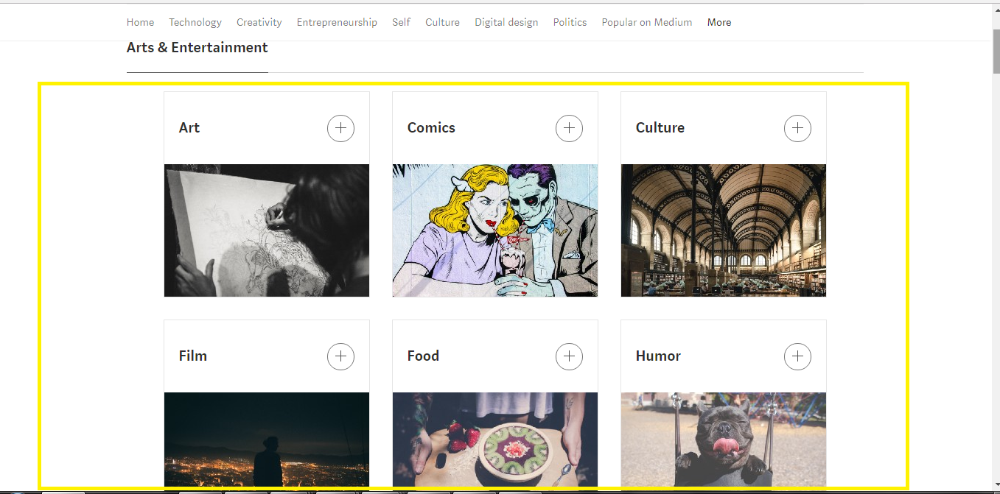

